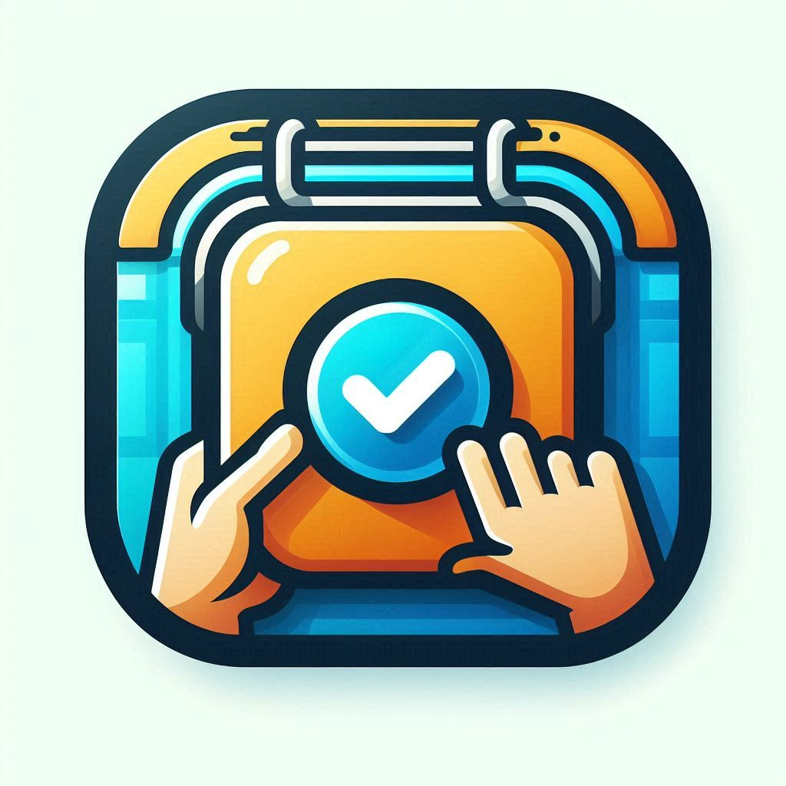

# Proyecto: Aplicación de Tareas



## Descripción

Esta aplicación es un gestor de tareas que permite a los usuarios crear, leer, actualizar y eliminar (CRUD) tareas de manera sencilla. Está diseñada como una herramienta para practicar y cimentar conocimientos en desarrollo web, específicamente con Django y Bootstrap, y se basa en el aprendizaje mediante el método de prueba y error.

## Objetivo del Proyecto

El objetivo principal de este proyecto es practicar el desarrollo web para cimentar conocimientos y aprender de los errores. A través de la implementación de esta aplicación, se busca:

- **Mejorar las habilidades de programación**: Aplicar y profundizar en los conocimientos adquiridos en Django, HTML, CSS y JavaScript.
- **Práctica de CRUD**: Implementar las operaciones básicas de creación, lectura, actualización y eliminación de tareas.
- **Aprendizaje de buenas prácticas**: Aplicar buenas prácticas de desarrollo, como el uso de Bootstrap para una mejor interfaz de usuario y la organización del código.
- **Gestión de errores**: Aprender a manejar errores comunes y mejorar la capacidad de depuración en el desarrollo web.

## Tecnologías Utilizadas

- **Python**
- **Django**: Un marco de trabajo de Python para el desarrollo de aplicaciones web.
- **Bootstrap**: Un framework CSS para desarrollar diseños responsivos y móviles.
- **HTML**: Lenguaje de marcado utilizado para estructurar el contenido de la aplicación.
- **CSS**: Lenguaje de estilos utilizado para diseñar y dar estilo a la aplicación.

## Instalación

Para ejecutar esta aplicación en tu entorno local, sigue estos pasos:

1. **Clonar el repositorio**:
   ```bash
   git clone <URL-del-repositorio>
   cd nombre-del-repositorio
